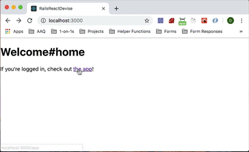
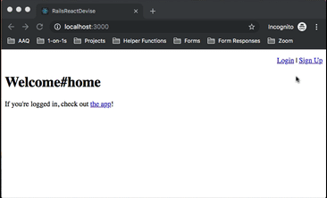
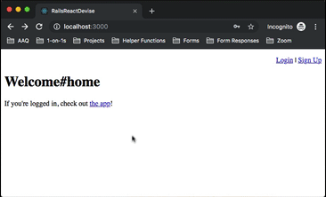

# README

This README covers how to set up a Rails/React app for User authentication using Devise

- [Set up Webpacker](#set-up-webpacker)
- [Generate the client app with create-react-app](#generate-the-client-app-with-create-react-app)
- [configure webpacker to read from create-react-app](#configure-webpacker-to-read-from-create-react-app)
- [add a home route and a route to mount the react app](#add-a-home-route-and-a-route-to-mount-the-react-app)
- [install devise and set up user logins](#install-devise-and-set-up-user-logins)
- [check for authentication before rendering the react view](#check-for-authentication-before-rendering-the-react-view)
- [create a posts resource and some seeds](#create-a-posts-resource-and-some-seeds)
- [add react router and a posts index that pulls the current user's posts](#add-react-router-and-a-posts-index-that-pulls-the-current-user's-posts)
- and link to a new post component
- configure new post component to pull csrf token from view and add to headers on fetch request

### My Environment

Ruby Version: 2.6.1

Rails Version: 5.2.3

Node Version: 12.1.0

OS: Mac OS 10.12.6

Text Editor: Visual Studio Code

### Tips before we start

When you finish one of each step, it's a good idea to make a commit, that way you can see in your version control which files are being added/modified in each step. (In VS Code, I see this in the source control view within the left hand menu bar.)

## Set up Webpacker

We'll want to add webpacker to the gemfile

```
gem 'webpacker'
```
and run `bundle install`. Then we'll do 
```
rails webpacker:install
```
Finally, we'll want some of the configuration we get from installing webpacker for react, so let's do
```
rails webpacker:install:react
```
We'll keep all of the changes except for the hello_react component.


## Generate the client app with create-react-app

Now we'll want to generate the client app

```
create-react-app client
```
After this, make sure to add this to your .gitignore file at the root so the repo doesn't have all your node_modules in client:
```
# .gitignore
/client/node_modules
```
We'll also want to remove all references to serviceworker in index.js so it looks like this:
```
import React from 'react';
import ReactDOM from 'react-dom';
import './index.css';
import App from './App';


ReactDOM.render(<App />, document.getElementById('root'));


```

## Configure Webpacker to Read From create-react-app

To get webpacker working with create-react-app, you'll want to change the first couple of lines of the default configuration in `config/webpacker.yml` from:
```
default: &default
  source_path: app/javascript
  source_entry_path: packs
```

to:
```
default: &default
  source_path: client
  source_entry_path: src
```

## Add a Home Route and a Route to Mount The React App

We'll generate a welcome controller with a couple of actions to handle a home page and also our react app.

```
rails g controller welcome home app --no-assets --no-helper
```

We'll set up the routes like this:
```
Rails.application.routes.draw do
  get 'welcome/home'
  get '/app', to: 'welcome#app', as: 'app'
  # For details on the DSL available within this file, see http://guides.rubyonrails.org/routing.html
  root 'welcome#home'
end
```
Then we'll add a link from the home view to the app view.
```
# app/views/welcome/home.html.erb
<h1>Welcome#home</h1>
<p>If you're logged in, check out <%= link_to "the app", app_path %>!</p>
```
Finally, we'll add the code we need to mount the react app in the app view:
```
# app/views/welcome/app.html.erb
<div id="root"></div>
<%= javascript_pack_tag 'index' %>
```
Now, let's check it out in the browser, if you click the link you should see create-react-app's landing page



## Install Devise and Set Up User Logins

First, let's add devise to the gemfile

```
gem 'devise'
```

and the run `bundle install`

Next we'll run the devise installer:
```
rails g devise:install
```
Then, following along with the 4 printed instructions we get after it runs, we'll add default_url_options for action mailer to the development environment file.

```
# config/environments/development.rb
config.action_mailer.default_url_options = { host: 'localhost', port: 3000 }
```

I usually puts this at around line 38 (right below the rest of the action_mailer config at the time of this writing).

Next, let's add some flash messages above the yield tag in our application layout:

```
# app/views/layouts/application.html.erb
  <p class="notice"><%= notice %></p>
  <p class="alert"><%= alert %></p>
```

Note, I skipped steps 2 and 4 because in our case we've already got a root route, and we're not going to do any customization of the default devise views. If you want to customize the login and signup forms, feel free to run 

```
rails g devise:views
```

At this point, we'll want to actually create our users:

```
rails g devise User
```

[Devise](https://github.com/plataformatec/devise) has a bunch of features we can turn on and off, for now I'm going to stick with the defaults. To add our table we'll run 

```
rails db:migrate
```

Before we hop back into the browser, let's add some simple navigation to our home view so we log in and signup/logout of our little app. (Note, we're adding this in the home view and not the layout because our react app will have its own navigation)

```
# app/views/welcome/home.html.erb
<nav style="text-align: right">
<% if user_signed_in? %>
    <%= link_to('Logout', destroy_user_session_path, method: :delete) %>          
  <% else %>
    <%= link_to('Login', new_user_session_path)  %> |
    <%= link_to('Sign Up', new_user_registration_path)  %>  
  <% end %>
</nav>
<h1>Welcome#home</h1>
<p>If you're logged in, check out <%= link_to "the app", app_path %>!</p>
```

Now we can head back to the browser and try creating a new account. 

**NOTE**: you'll need to restart your rails server if you had it running while setting up devise



Now that we have users, we can work on restricting the app to only logged in users.

## Check for Authentication Before Rendering the React View

Now that we've got authentication up and running, let's protect our app so only logged in users can view it. The quickest way to do this is to add a redirect to the controller action that will render our react app unless a user is signed in.

```
class WelcomeController < ApplicationController
  before_action :authenticate_user!, only: [:app]
  def home
  end

  def app
    
  end
end
```

Now if we try to click on the link to the app page in the browser, we get redirected to the login screen. After logging in, it sends us to the app.



## Create a Posts Resource and Some Seeds

Next, let's create a posts resource so we can set up a couple of AJAX requests from our react front end to our rails API. 

```
rails g resource post title content:text user:references --no-assets --no-helper
```

then we can run 
```
rails db:migrate
``` 
to update our database with the posts table.

We'll also want to make sure that we update the user model so it has many posts:

```
# app/models/user.rb
class User < ApplicationRecord
  # Include default devise modules. Others available are:
  # :confirmable, :lockable, :timeoutable, :trackable and :omniauthable
  devise :database_authenticatable, :registerable,
         :recoverable, :rememberable, :validatable
  has_many :posts
end

```

Finally, let's add some seeds so we've got some posts to work with.

```
# db/seeds.rb
user = User.first || User.create(email: 'test@test.com', password: 'password', password_confirmation: 'password')
posts = [
  {
    title: 'My first post', 
    content: 'The start of something special'
  },
  {
    title: 'My second post', 
    content: 'This is really getting good'
  },
  {
    title: 'Oh my god, Yeah!!!',
    content: 'Enough said.'
  }
]
posts.each do |post_hash|
  user.posts.create(post_hash)
end
```

Then we can run those with `rails db:seed`

## Add React Router and a Posts Index that Pulls the Current User's Posts

To start, we'll want to cd into the client directory and add in the dependencies we'll need here.

```
cd client
yarn add react-router-dom react-redux redux
```

